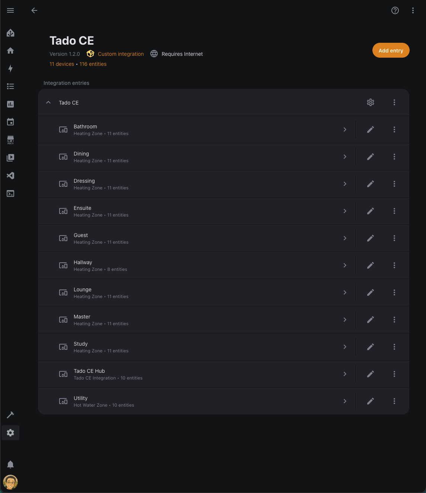
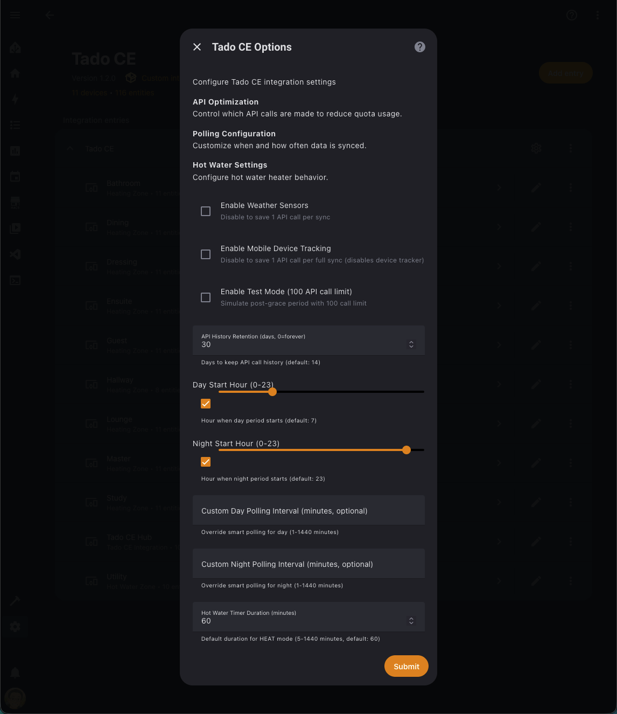
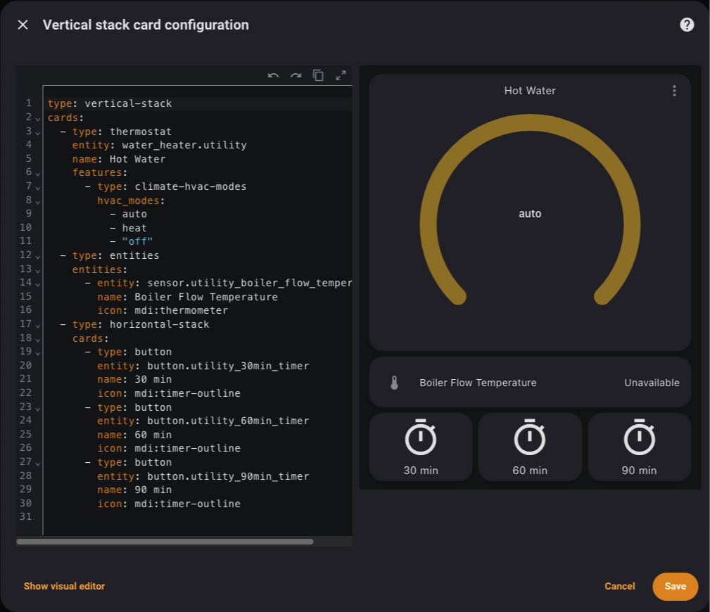

# Tado CE - Custom Integration for Home Assistant

<div align="center">

<!-- Platform Badges -->
  

<!-- Status Badges -->
   

<!-- Community Badges -->
   

**A lightweight custom integration for Tado smart thermostats with real API rate limit tracking from Tado's response headers.**

[Features](#-features) • [Quick Start](#-quick-start) • [Entities](#-entities) • [Services](#-services) • [Troubleshooting](#-troubleshooting)

</div>

---

## 🤔 Why Tado CE?

In late 2025, Tado announced they would begin enforcing **daily API rate limits** on their REST API. This caught many Home Assistant users off guard:

| Plan | Daily Limit |
|------|-------------|
| Standard (after grace period) | 100 calls |
| Standard (grace period) | 5,000 calls |
| Auto-Assist subscription | 20,000 calls |

The official Home Assistant Tado integration doesn't show your actual API usage or remaining quota. Users have no way to know if they're about to hit the limit until they get blocked.

**Common issues reported by the community:**

- [Upcoming changes to the tado° API](https://github.com/home-assistant/core/issues/151223) - Official announcement
- [Tado rate limiting API calls](https://community.home-assistant.io/t/tado-rate-limiting-api-calls/928751) - Community discussion
- [Tado Authentication Broken](https://github.com/home-assistant/core/issues/160472) - Auth issues after HA update
- [Tado login fails](https://github.com/home-assistant/core/issues/161054) - Login timeout issues
- [Re-Authentication loop](https://github.com/home-assistant/core/issues/160237) - Keeps asking for re-auth
- [Bad error handling](https://github.com/home-assistant/core/issues/160487) - Poor error messages
- [Tado Integration Stopped Working](https://community.home-assistant.io/t/tado-integration-stopped-working/867145) - Password flow deprecated

**Tado CE was created to solve these problems:**

1. **Real-time rate limit tracking** - See exactly how many API calls you've used
2. **Dynamic limit detection** - Automatically detects your actual limit (100/5000/20000)
3. **Reset time tracking** - Know when your quota resets (from Tado API headers)
4. **Smart day/night polling** - More frequent during day, less at night
5. **Lightweight design** - Minimal API calls, maximum functionality

---

## 🎯 Features

| Feature | Description |
|---------|-------------|
| 🌡️ **Climate Control** | Control all your Tado heating zones (Heat/Off/Auto modes) |
| ❄️ **AC Control** | Full air conditioning support (Cool/Heat/Dry/Fan modes, fan speed, swing) |
| 🚿 **Hot Water Control** | Control hot water with AUTO/HEAT/OFF modes and configurable timer duration |
| ⏱️ **Timer Support** | Set heating/cooling/hot water for specific duration or until next schedule |
| 🔥 **Heating Power** | See current heating demand percentage (0-100%) |
| 💧 **Humidity** | Current humidity displayed on climate entities |
| ⏰ **Early Start** | Smart pre-heating to reach target temperature on time |
| 🪟 **Open Window** | Automatic detection when windows are open |
| 🏠 **Home/Away** | Geofencing support with configurable away temperature |
| 🏃 **Away Mode Switch** | Manually toggle Home/Away status |
| 🎯 **Preset Mode** | Home/Away presets on climate entities |
| 📍 **Presence Detection** | Track mobile devices with geo tracking enabled |
| 🌤️ **Weather Data** | Outside temperature, solar intensity, weather conditions |
| 🌡️ **Temperature Offset** | Calibrate device temperature readings |
| 🔒 **Child Lock** | Enable/disable child lock on radiator valves |
| 💡 **Device Identify** | Flash device LED to locate it |
| ⚡ **Energy IQ** | Add meter readings for energy tracking |
| 📶 **Connection State** | Monitor device online/offline status |
| 🔧 **Firmware Version** | Track device firmware versions |
| 🔐 **Device Auth Flow** | Secure OAuth2 device authorization (password grant deprecated) |
| 🔑 **Rotating Tokens** | Handles Tado's rotating refresh tokens correctly |
| 💾 **Persistent Storage** | Token and data survives Home Assistant reboots |

### 🌟 Tado CE Exclusive

| Feature | Description |
|---------|-------------|
| 📊 **Real API Rate Limit** | Actual usage from Tado API headers, not estimates |
| 🔄 **Reset Time from API** | Automatically detects when your rate limit resets |
| ⚡ **Smart Day/Night Polling** | More frequent during day, less at night to save API calls |
| 🏠 **Multi-Home Selection** | Select which home to configure during setup (v1.4.0) |
| 🏢 **Zone-Based Devices** | Each zone appears as separate device for better organization (v1.2.0) |
| 🏷️ **Improved Entity Names** | Cleaner names without "Tado CE" prefix for zone entities (v1.2.0) |
| 🌤️ **Optional Weather** | Toggle weather sensors on/off to save 1 API call per sync (v1.2.0) |
| 📱 **Optional Mobile Tracking** | Toggle mobile device tracking on/off to save 1 API call per full sync (v1.2.0) |
| 📈 **API Call Tracking** | Track all API calls with persistent history (configurable retention) (v1.2.0) |
| ⏰ **Enhanced Reset Display** | Exact reset timestamp in local timezone (v1.2.0) |
| ⚡ **Immediate Refresh** | Dashboard updates immediately after user actions (v1.2.0) |
| ⚙️ **Customizable Polling** | Configure day/night hours and custom polling intervals (v1.2.0) |
| 🚿 **Hot Water Modes** | Enhanced AUTO/HEAT/OFF modes with configurable timer and state detection (v1.2.0) |
| 🔘 **Hot Water Presets** | Quick-access timer buttons (30/60/90 min) for hot water (v1.2.0) |
| 🌡️ **Boiler Flow Temp** | Auto-detected boiler flow temperature sensor for OpenTherm systems (v1.4.0) |

---

## 📋 Prerequisites

- Home Assistant 2024.1 or later (tested on 2026.1.2)
- Tado account with V3/V3+ devices

---

## 🚀 Quick Start

### 1. Install

**HACS (Recommended)**
```
Add this repository to HACS as a custom repository
Install "Tado CE" from HACS
Restart Home Assistant
```

**Manual Installation**
```bash
# Copy tado_ce folder to custom_components
cp -r tado_ce /config/custom_components/
```

### 2. Add Integration & Authenticate

1. Go to **Settings → Devices & Services**
2. Click **Add Integration**
3. Search for **Tado CE**
4. Click **Submit** to start authorization
5. Click the link or visit `https://login.tado.com/device` and enter the code shown
6. Authorize in your browser
7. Click **Submit** when done
8. If you have multiple homes, select which one to use

That's it! No SSH required. The integration handles everything through Tado's secure device authorization flow.

---

## 🔄 Migrating from v1.1.0 to v1.2.x

**⚠️ IMPORTANT: v1.2.0+ includes breaking changes. Please read carefully before upgrading.**

### What's Changed

1. **Service Name Change** (Breaking Change)
   - `set_temperature_offset` renamed to `set_climate_temperature_offset`
   - **Action Required**: Update your automations to use the new service name
   - Parameters remain unchanged
   
   ```yaml
   # Old (v1.1.0)
   service: tado_ce.set_temperature_offset
   
   # New (v1.2.0)
   service: tado_ce.set_climate_temperature_offset
   ```

2. **Zone-Based Devices** (Breaking Change)
   - Each Tado zone now appears as a separate device
   - Zone entities are assigned to their respective zone devices
   - Hub entities remain on the Tado CE Hub device
   - **Entity IDs are preserved** - automations continue to work

3. **Improved Entity Names**
   - Zone entities no longer have "Tado CE" prefix
   - Example: "Living Room Temperature" instead of "Tado CE Living Room Temperature"
   - Hub entities retain "Tado CE" prefix

### Migration Steps

**⚠️ If upgrading from v1.1.0, the integration will automatically clean up any duplicate hubs. This issue is fixed in v1.2.1.**

**Recommended Upgrade Path (Clean Install):**

1. **Backup Your Configuration**
   - Export automations and dashboards
   - Take screenshots of your current setup

2. **Remove Old Integration**
   - Settings → Devices & Services → Tado CE → "..." → Delete
   - If you see two Tado CE entries, delete both

3. **Restart Home Assistant**

4. **Re-add the Integration**
   - Settings → Devices & Services → Add Integration → Tado CE
   - Your entity IDs will be preserved

**Alternative: Update in Place (v1.2.1+)**

If you're upgrading to v1.2.1 or later, the integration includes automatic migration:

1. **Update Automations First**
   - Search for `tado_ce.set_temperature_offset`
   - Replace with `tado_ce.set_climate_temperature_offset`
   - Update hot water automations: `operation_mode: "on"` → `operation_mode: "heat"`

2. **Update via HACS**
   - HACS → Integrations → Tado CE → Update
   - Restart Home Assistant
   - Migration will run automatically

3. **Verify Everything Works**
   - Check you only have ONE Tado CE hub
   - Verify all zones are visible
   - Test manual controls

### Troubleshooting Upgrade Issues

**Problem: Two Tado CE Hubs After Upgrade**

This was an issue when upgrading from v1.1.0 to v1.2.0. **Fixed in v1.2.1** with automatic cleanup.

**If you're on v1.2.1+**: The integration will automatically remove duplicate entries on startup.

**If you're still on v1.2.0 with duplicates**: Update to v1.2.1 first, or:
1. Remove BOTH integration entries (Settings → Devices & Services → Tado CE → Delete)
2. Restart Home Assistant
3. Re-add the integration

**Problem: Missing zones_info.json Error**

```
Failed to load zone names: [Errno 2] No such file or directory: 
'/config/custom_components/tado_ce/data/zones_info.json'
```

**Solution:**
- This file is created automatically on first sync
- If error persists, restart Home Assistant to trigger a full sync

**Problem: All Entities Still Have "Tado CE" Prefix**

This means the old integration entry is still active.

**Solution:**
1. Remove all Tado CE integration entries
2. Restart Home Assistant
3. Re-add the integration

### Update Automations
   - Search for `tado_ce.set_temperature_offset`
   - Replace with `tado_ce.set_climate_temperature_offset`
   - Update hot water automations: `operation_mode: "on"` → `operation_mode: "heat"`
   
   **Hot Water Mode Change Example:**
   ```yaml
   # Old (v1.1.0)
   service: water_heater.set_operation_mode
   target:
     entity_id: water_heater.utility
   data:
     operation_mode: "on"
   
   # New (v1.2.0)
   service: water_heater.set_operation_mode
   target:
     entity_id: water_heater.utility
   data:
     operation_mode: "heat"
   ```

3. **Upgrade the Integration**
   - Update via HACS or manual installation
   - Restart Home Assistant

4. **Verify Everything Works**
   - Check all automations are working
   - Verify dashboard cards show correct data
   - Test manual controls

### What You'll See After Upgrade

- ✅ New devices appear for each zone (e.g., "Living Room", "Bedroom")
- ✅ Entities move from hub device to zone devices
- ✅ Entity names are cleaner (no "Tado CE" prefix for zones)
- ✅ All entity IDs remain the same
- ✅ Automations continue to work (after service name update)

### Need Help?

See the migration guide above for detailed instructions on updating your automations and configuration.

---

### Visual Guide: Zone-Based Devices

<div align="center">
  
  <p><em>Each Tado zone appears as a separate device with clean entity names</em></p>
</div>

---

### 4. Verify Success

Check your Home Assistant logs (**Settings → System → Logs**). A successful setup looks like:

```
Tado CE: Integration loading...
Tado CE: Polling interval set to 30m (day)
Tado CE: Executing full sync
Tado CE full sync SUCCESS
Tado CE binary_sensor: Setting up...
Tado CE water_heater: Setting up...
Tado CE device_tracker: Setting up...
Tado CE switch: Setting up...
Tado CE water heaters loaded: 1
Tado CE switches loaded: 17
Tado CE binary sensors loaded: 10
Tado CE sensors loaded: 69
Tado CE climates loaded: 9
Tado CE: Integration loaded successfully
```

The exact numbers depend on your Tado setup (zones, devices, etc.).

---

## ⚙️ Configuration Options

After installation, you can configure Tado CE by clicking the **gear icon** on the integration card in **Settings → Devices & Services → Tado CE**.

### Available Options

#### API Optimization

**Enable Weather Sensors**
- **Unchecked** (default): Weather sensors disabled, saves 1 API call per sync
- **Checked**: Weather sensors enabled (outside temperature, solar intensity, weather condition)

**Enable Mobile Device Tracking**
- **Checked** (default): Mobile device tracking enabled (device tracker entities)
- **Unchecked**: Mobile device tracking disabled, saves 1 API call per full sync

**Enable Test Mode (100 API call limit)**
- **Unchecked** (default): Normal operation with your actual API limit
- **Checked**: Simulates post-grace period with 100 call limit for testing

**API History Retention (days, 0=forever)**
- **Default**: 14 days
- **0**: Keep forever
- **Number**: Days to keep API call history

#### Polling Configuration

**Day Start Hour (0-23)**
- **Checkbox checked**: Use your custom hour (slider value)
- **Checkbox unchecked**: Use default (7am)
- Defines when "day" period starts for smart polling

**Night Start Hour (0-23)**
- **Checkbox checked**: Use your custom hour (slider value)
- **Checkbox unchecked**: Use default (11pm)
- Defines when "night" period starts for smart polling

**Custom Day Polling Interval (minutes, optional)**
- **Empty**: Use smart polling based on API quota
- **Number (1-1440)**: Override smart polling with fixed interval for day period
- Warning shown if interval may exceed API quota

**Custom Night Polling Interval (minutes, optional)**
- **Empty**: Use smart polling based on API quota
- **Number (1-1440)**: Override smart polling with fixed interval for night period
- Warning shown if interval may exceed API quota

**Note**: When custom intervals are not set, Tado CE uses smart polling that automatically adjusts based on your API quota. See [Smart Polling](#️-smart-polling) section for details.

#### Hot Water Settings

**Hot Water Timer Duration (minutes)**
- **Default**: 60 minutes
- **Range**: 5-1440 minutes
- Duration used when HEAT mode is activated on hot water heater

<div align="center">
  
  <p><em>Advanced configuration options for API optimization, polling, and hot water settings</em></p>
</div>

### 🔍 Verifying Configuration Changes

**Important**: Configuration changes take effect **immediately** without requiring a Home Assistant restart. The integration automatically reloads when you save options.

#### How to Verify Options Are Working

**1. Test Mode Verification**

When Test Mode is enabled, check the logs to confirm it's active:

```bash
# SSH into Home Assistant
ha core logs | grep -i "test mode"
```

**Example: Enabling Test Mode**

When you enable Test Mode in the UI and save:

```
2026-01-21 08:40:18 WARNING (MainThread) [custom_components.tado_ce] Tado CE: Integration loading...
2026-01-21 08:40:18 WARNING (MainThread) [custom_components.tado_ce] Tado CE: Already setup, cancelling old polling timer
2026-01-21 08:40:18 WARNING (SyncWorker_1) [custom_components.tado_ce] Tado CE: Test Mode limit reached (281/100 calls). Polling paused until quota resets.
2026-01-21 08:40:18 WARNING (MainThread) [custom_components.tado_ce] Tado CE: Integration loaded successfully
```

**What this means:**
- Integration automatically reloaded (no manual restart needed)
- Test Mode detected 281 calls > 100 limit
- Polling paused until quota resets

**Example: Disabling Test Mode**

When you disable Test Mode in the UI and save:

```
2026-01-21 08:41:34 WARNING (MainThread) [custom_components.tado_ce] Tado CE: Integration loading...
2026-01-21 08:41:34 WARNING (MainThread) [custom_components.tado_ce] Tado CE: Already setup, cancelling old polling timer
2026-01-21 08:41:35 WARNING (MainThread) [custom_components.tado_ce] Tado CE: Integration loaded successfully
```

**What this means:**
- Integration automatically reloaded
- No "Test Mode limit reached" message
- Polling resumed with real API limit (e.g., 5000 calls)

**2. Weather Sensors Verification**

After changing the weather sensors option:

```bash
# Check for weather sensor entities
ha core logs | grep -i "weather"
```

**Weather Enabled:**
```
2026-01-21 08:45:00 WARNING (MainThread) [custom_components.tado_ce.sensor] Tado CE sensors loaded: 75
```

Check for these entities:
- `sensor.tado_ce_outside_temperature`
- `sensor.tado_ce_solar_intensity`
- `sensor.tado_ce_weather_state`

**Weather Disabled:**
```
2026-01-21 08:45:00 WARNING (MainThread) [custom_components.tado_ce.sensor] Tado CE sensors loaded: 72
```

Weather sensor entities will not be created (3 fewer sensors).

**3. Mobile Device Tracking Verification**

After changing the mobile device tracking option:

```bash
# Check for device tracker entities
ha core logs | grep -i "device tracker"
```

**Mobile Tracking Enabled:**
```
2026-01-21 08:45:00 WARNING (MainThread) [custom_components.tado_ce.device_tracker] Tado CE: Mobile device tracking enabled
```

Check for `device_tracker.tado_ce_{device}` entities (only if devices have geo tracking enabled in Tado app).

**Mobile Tracking Disabled:**
```
2026-01-21 08:45:00 WARNING (MainThread) [custom_components.tado_ce.device_tracker] Tado CE: No devices with geo tracking enabled
```

Device tracker entities will not be created.

**4. Polling Interval Verification**

After changing day/night hours or custom intervals:

```bash
# Check polling interval
ha core logs | grep -i "polling interval"
```

**Example Output:**
```
2026-01-21 08:45:00 INFO [custom_components.tado_ce] Tado CE: Polling interval set to 30m (day)
```

The interval shown depends on:
- Your API quota (100/1000/5000/20000)
- Current time (day vs night)
- Custom intervals (if configured)
- Test Mode (if enabled)

**5. API History Retention Verification**

Check the `sensor.tado_ce_api_limit` entity attributes to see how many calls are tracked:

```yaml
recent_calls_count: 100  # Should match your retention setting
total_calls_tracked: XXX
```

**6. Hot Water Timer Duration Verification**

After changing the timer duration:
1. Go to your hot water heater entity
2. Select "HEAT" mode
3. Check the logs:

```bash
ha core logs | grep -i "timer"
```

You should see your configured duration being used.

#### Troubleshooting Configuration Changes

If changes don't seem to take effect:

1. **Check the logs** for any errors during reload:
   ```bash
   ha core logs | grep -i "tado ce"
   ```

2. **Verify config.json was updated**:
   ```bash
   cat /config/custom_components/tado_ce/data/config.json
   ```

3. **Manual restart** (last resort):
   ```bash
   ha core restart
   ```

**Note**: The integration automatically reloads when you save configuration changes. You should see "Tado CE: Options changed, reloading integration..." in the logs.

---

### 5. Device Overview

Once set up, you'll see your Tado zones organized as separate devices with clean entity names.

---

## 📊 Entities

### API Sensors (Hub Entities)

| Entity | Description |
|--------|-------------|
| `sensor.tado_ce_api_usage` | API calls used today (e.g. "142/5000") |
| `sensor.tado_ce_api_reset` | Time until rate limit resets (e.g. "5h 30m") |

### Weather Sensors (Hub Entities)

| Entity | Description |
|--------|-------------|
| `sensor.tado_ce_outside_temperature` | Outside temperature at your location |
| `sensor.tado_ce_solar_intensity` | Solar intensity percentage |
| `sensor.tado_ce_weather_state` | Current weather condition |

### Per Heating Zone (Zone Entities - No Prefix)

| Entity | Description |
|--------|-------------|
| `climate.{zone}` | Climate entity for control |
| `sensor.{zone}_temperature` | Current temperature |
| `sensor.{zone}_humidity` | Current humidity |
| `sensor.{zone}_heating` | Heating power (0-100%) |
| `sensor.{zone}_target` | Target temperature |
| `sensor.{zone}_mode` | Mode (Manual/Schedule/Off) |
| `sensor.{zone}_battery` | Battery status (NORMAL/LOW) |
| `sensor.{zone}_connection` | Device connection (Online/Offline) |
| `binary_sensor.{zone}_open_window` | Open window detected |

**Note:** `{zone}` is your zone name in lowercase with spaces replaced by underscores. For example, "Living Room" becomes `living_room`.

### Switches (Zone & Hub Entities)

| Entity | Description | API Calls |
|--------|-------------|-----------|
| `switch.tado_ce_away_mode` | Toggle Home/Away mode manually (Hub) | 1 per toggle |
| `switch.{zone}_child_lock` | Enable/disable child lock (Zone) | 1 per toggle |
| `switch.{zone}_early_start` | Enable/disable smart pre-heating (Zone) | 1 per toggle |

### Other Entities

| Entity | Description |
|--------|-------------|
| `binary_sensor.tado_ce_home` | Home/Away status (geofencing) - Hub |
| `water_heater.{zone}` | Hot water control with AUTO/HEAT/OFF modes |
| `sensor.{zone}_boiler_flow_temperature` | Boiler flow temperature (hot water zones only) |
| `button.{zone}_timer_30min` | Quick 30-minute hot water timer |
| `button.{zone}_timer_60min` | Quick 60-minute hot water timer |
| `button.{zone}_timer_90min` | Quick 90-minute hot water timer |
| `device_tracker.tado_ce_{device}` | Mobile device presence - Hub |

The water heater entity supports three operation modes:

| Mode | Description | API Action |
|------|-------------|------------|
| **AUTO** | Follow Tado schedule | Deletes any overlay, returns to programmed schedule |
| **HEAT** | Turn on with timer | Creates timer overlay with configurable duration (default 60 min) |
| **OFF** | Turn off | Creates manual overlay with power OFF |

**Configuring Timer Duration:**

1. Go to Home Assistant Settings → Devices & Services → Tado CE
2. Click "Configure"
3. Set "Hot Water Timer Duration" (5-1440 minutes, default 60)
4. Next time you select HEAT mode, it will use the new duration

**When to use each mode:**

- **AUTO**: Most common - let Tado follow your programmed schedule
- **HEAT**: Temporary boost - heat water for a specific duration (e.g., unexpected guests)
- **OFF**: Turn off water heating (e.g., going on vacation)

<div align="center">
  
  <p><em>Hot water entity with AUTO/HEAT/OFF modes, timer presets, and boiler temperature</em></p>
</div>

**Dashboard Card Example:**

You can create a similar card on your dashboard using this YAML:

```yaml
type: vertical-stack
cards:
  # Water Heater Card
  - type: thermostat
    entity: water_heater.YOUR_ZONE_NAME
    name: Hot Water
    features:
      - type: climate-hvac-modes
        hvac_modes:
          - auto
          - heat
          - 'off'
  
  # Boiler Temperature
  - type: entities
    entities:
      - entity: sensor.YOUR_ZONE_NAME_boiler_flow_temperature
        name: Boiler Flow Temperature
        icon: mdi:thermometer
  
  # Timer Preset Buttons
  - type: horizontal-stack
    cards:
      - type: button
        entity: button.YOUR_ZONE_NAME_30min_timer
        name: 30 min
        icon: mdi:timer-outline
      - type: button
        entity: button.YOUR_ZONE_NAME_60min_timer
        name: 60 min
        icon: mdi:timer-outline
      - type: button
        entity: button.YOUR_ZONE_NAME_90min_timer
        name: 90 min
        icon: mdi:timer-outline
```

Replace `YOUR_ZONE_NAME` with your hot water zone name (e.g., `utility`, `hot_water`, `boiler`).

---

## 🔧 Services

### tado_ce.set_climate_timer

Set heating/cooling with a timer. **Compatible with official Tado integration.**

```yaml
service: tado_ce.set_climate_timer
target:
  entity_id: climate.lounge
data:
  temperature: 22
  duration: 60  # minutes
```

**Overlay options:**

- `duration: 60` - Timer in minutes
- `overlay: next_time_block` - Until next schedule block
- Neither - Manual (until manually changed)

### tado_ce.set_water_heater_timer

Turn on hot water with a timer. **Compatible with official Tado integration.**

```yaml
service: tado_ce.set_water_heater_timer
target:
  entity_id: water_heater.utility
data:
  duration: 30  # minutes
```

**Note**: This service activates HEAT mode. See [Hot Water Operation Modes](#hot-water-operation-modes) for details.

### tado_ce.resume_schedule

Delete any manual override and return to schedule.

```yaml
service: tado_ce.resume_schedule
target:
  entity_id: climate.lounge
```

### tado_ce.set_climate_temperature_offset

Set temperature offset (calibration) for a device. **Compatible with official Tado integration.**

```yaml
service: tado_ce.set_climate_temperature_offset
data:
  entity_id: climate.lounge
  offset: 0.5  # Celsius (-10 to +10)
```

**Note**: This service was renamed from `set_temperature_offset` in v1.2.0 for compatibility with the official Tado integration. Parameters remain unchanged.

### tado_ce.identify_device

Make a device flash its LED.

```yaml
service: tado_ce.identify_device
data:
  device_serial: "VA1234567890"
```

### tado_ce.set_away_configuration

Configure temperature when everyone is away.

```yaml
service: tado_ce.set_away_configuration
data:
  entity_id: climate.lounge
  mode: auto  # auto, manual, or off
  comfort_level: 50  # 0=Eco, 50=Balance, 100=Comfort
```

### tado_ce.add_meter_reading

Add energy meter reading for Energy IQ. **Enhanced in Tado CE with historical date support.**

```yaml
service: tado_ce.add_meter_reading
data:
  reading: 12345
  date: "2026-01-17"  # Optional - defaults to today (Tado CE enhancement)
```

**Tado CE Enhancement**: Unlike the official integration, Tado CE allows you to specify a date for historical readings. This is useful for catching up on missed readings or importing historical data.

---

## ⏱️ Smart Polling

The integration automatically adjusts polling frequency based on your API limit and time of day.

### Polling Schedule

| API Limit | Day (7am-11pm) | Night (11pm-7am) | Est. Calls/Day |
|-----------|----------------|------------------|----------------|
| 100 | 30 min | 2 hours | ~80 calls |
| 1,000 | 15 min | 1 hour | ~160 calls |
| 5,000 | 10 min | 30 min | ~240 calls |
| 20,000 | 5 min | 15 min | ~480 calls |

### 100 Calls/Day Breakdown

| Time Period | Duration | Interval | Syncs | Calls | Total |
|-------------|----------|----------|-------|-------|-------|
| Day (7am-11pm) | 16h | 30 min | 32 | 2 | 64 |
| Night (11pm-7am) | 8h | 2h | 4 | 2 | 8 |
| Full sync | 24h | 6h | 4 | 2 | 8 |
| **Total** | | | | | **80** |

This leaves a 20% buffer for manual syncs or service calls.

---

## 📱 Supported Devices

| Device | Type | Support |
|--------|------|---------|
| Smart Thermostat V3/V3+ | HEATING | ✅ Full |
| Smart Radiator Thermostat (SRT/VA02) | HEATING | ✅ Full |
| Smart AC Control V3/V3+ | AIR_CONDITIONING | ✅ Full |
| Wireless Temperature Sensor | HEATING | ✅ Full |
| Internet Bridge V3 | Infrastructure | N/A |
| **Tado X Series** | Matter/Thread | ❌ Not Supported |

### ⚠️ Tado X Devices

Tado X devices use Matter over Thread and are **not supported** by this integration. Use the Home Assistant Matter integration instead.

See [Using tado° Smart Thermostat X through Matter](https://community.home-assistant.io/t/using-tado-smart-thermostat-x-through-matter/736576) for setup instructions.

---

## ⚠️ Limitations

| Limitation | Description |
|------------|-------------|
| **Cloud-Only** | All control goes through Tado's cloud servers |
| **No GPS** | Device trackers only show home/not_home status |
| **Rotating Tokens** | If token expires, re-authentication required |
| **No Schedule Management** | Use Tado app for schedule changes |
| **No Historical Data** | Would consume too many API calls |

---

## 🔮 Potential Future Features

These features are technically possible but not yet implemented. PRs welcome!

### ✅ Can Be Added (API Available)

| Feature | Description | API Calls | Priority |
|---------|-------------|-----------|----------|
| **Boost Mode** | Quick temperature boost for X minutes | 1 per action | Medium |
| **Open Window Duration** | Configure open window detection timeout | 1 per zone | Low |
| **Multiple Homes** | Support for users with multiple Tado homes | +2 per home | Low |
| **Air Comfort** | Humidity comfort level indicators | +1 per sync | Medium |
| **Skills/Routines** | Tado's built-in automation rules | Read-only | Low |

### ❌ Cannot Be Added (API Limitations)

| Feature | Reason |
|---------|--------|
| **Local Control** | Tado has no local API - cloud only |
| **GPS Coordinates** | Privacy - API only returns home/away status |
| **Schedule Editing** | Complex API, high call cost, use Tado app |
| **Push Notifications** | No webhook/push API available |
| **Tado X Devices** | Uses Matter protocol, not REST API |
| **Historical Charts** | Would require 100+ API calls per day |
| **Real-time Updates** | No WebSocket API, polling only |

### 🤔 Considering (Need User Feedback)

| Feature | Trade-off |
|---------|-----------|
| **Air Comfort Sensors** | +1 API call per sync, shows humidity comfort |
| **Boost Button** | Adds button entity, 1 API call per press |
| **Presence Confidence** | Show % confidence of presence detection |

Want a feature? [Open an issue](https://github.com/hiall-fyi/tado_ce/issues) or submit a PR!

---

## 🐛 Troubleshooting

### Token refresh failed / Re-authentication required

1. Go to **Settings → Devices & Services → Tado CE**
2. Click **Configure** or look for re-authentication prompt
3. Follow the device authorization flow (link + code)

### Check status

Check your Home Assistant logs: **Settings → System → Logs**

Filter by "tado_ce" to see integration-specific messages.

### No device tracker entities

Device trackers only appear for mobile devices with geo tracking enabled in the Tado app.

### Enable debug logging

For detailed troubleshooting, enable debug logging in your `configuration.yaml`:

```yaml
logger:
  default: info
  logs:
    custom_components.tado_ce: debug
```

This will show detailed information about:
- Token refresh operations and caching
- API call tracking with timestamps
- Rate limit header parsing
- Polling interval calculations
- Quota availability checks
- Configuration updates

After adding this, restart Home Assistant and check **Settings → System → Logs** for detailed debug information.

---

## 🆚 Comparison with Official Integration

| Feature | Official | Tado CE |
|---------|:--------:|:-------:|
| Climate Control | ✅ | ✅ |
| AC Control | ✅ | ✅ |
| Temperature/Humidity Sensors | ✅ | ✅ |
| Hot Water Control | ⚠️ Basic | ✅ Enhanced |
| Hot Water Timer Presets | ❌ | ✅ |
| Boiler Flow Temperature Sensor | ❌ | ✅ Auto-detect |
| Open Window Detection | ✅ | ✅ |
| Home/Away (Geofencing) | ✅ | ✅ |
| Presence Detection | ✅ | ✅ |
| Weather Data | ✅ | ✅ |
| Optional Weather Sensors | ❌ | ✅ |
| Optional Mobile Tracking | ❌ | ✅ |
| Child Lock Switch | ✅ | ✅ |
| Early Start Switch | ❌ | ✅ |
| Timer Overlay | ✅ | ✅ |
| Temperature Offset | ✅ | ✅ |
| Energy IQ | ✅ | ✅ |
| Energy IQ Historical Dates | ❌ | ✅ |
| Device Identify | ✅ | ✅ |
| Away Configuration | ✅ | ✅ |
| Connection State | ✅ | ✅ |
| Zone-Based Devices | ❌ | ✅ |
| **Multi-Home Selection** | ❌ | ✅ |
| **Real API Rate Limit** | ❌ | ✅ |
| **Reset Time Tracking** | ❌ | ✅ |
| **Dynamic Limit Detection** | ❌ | ✅ |
| **Smart Day/Night Polling** | ❌ | ✅ |
| **API Call Tracking** | ❌ | ✅ |
| **API History Retention** | ❌ | ✅ |
| **Test Mode Switch** | ❌ | ✅ |
| **Customizable Polling** | ❌ | ✅ |
| **Immediate Refresh** | ❌ | ✅ |

## 📚 Resources

- [Tado API Rate Limit Announcement](https://community.home-assistant.io/t/tado-rate-limiting-api-calls/928751)
- [Official Tado Integration](https://www.home-assistant.io/integrations/tado/)
- [Tado API Documentation (Community)](https://github.com/kritsel/tado-openapispec-v2)
- [Roadmap & Feature Requests](ROADMAP.md)
- [Complete Entities Reference](ENTITIES.md)
- [Release Credits & Community Contributors](RELEASE_CREDITS.md)

---

## 🆘 Support

For issues and questions:

1. Check the [Troubleshooting](#-troubleshooting) section
2. Check logs: **Settings → System → Logs**
3. [Open an issue on GitHub](https://github.com/hiall-fyi/tado_ce/issues)

---

## 📄 License

This project is licensed under the **GNU Affero General Public License v3.0 (AGPL-3.0)**.

### What this means:

- ✅ **Free to use** - Use this integration for personal or commercial purposes
- ✅ **Free to modify** - Adapt the code to your needs
- ✅ **Free to distribute** - Share with others

### Requirements:

- 📖 **Open Source** - Any modifications or derivative works must also be open source under AGPL-3.0
- 🙏 **Attribution** - You must give appropriate credit to the original author
- 🔗 **Source Available** - If you run a modified version as a network service, you must make the source code available

### Credits

**Original Author:** Joe Yiu ([@hiall-fyi](https://github.com/hiall-fyi))

If you use or modify this code, please include attribution:
```
Based on Tado CE by Joe Yiu (@hiall-fyi)
https://github.com/hiall-fyi/tado_ce
```

See [LICENSE](LICENSE) file for full details.

---

## 🤝 Contributing

Contributions are welcome! Please feel free to submit a Pull Request.

By contributing, you agree that your contributions will be licensed under the AGPL-3.0 license.

Check the [Roadmap](ROADMAP.md) for planned features and ideas.

1. Fork the repository
2. Create your feature branch (`git checkout -b feature/AmazingFeature`)
3. Commit your changes (`git commit -m 'Add some AmazingFeature'`)
4. Push to the branch (`git push origin feature/AmazingFeature`)
5. Open a Pull Request

---

## ⭐ Star History

If you find this integration useful, please consider giving it a star!

[](https://star-history.com/#hiall-fyi/tado_ce&Date)

---

<div align="center">

### 💖 Support This Project

If this integration has saved you from rate limit headaches, made your Tado setup better, or simply made your life easier, consider supporting the project!

**Your support helps me:**

<p align="center">
🔧 Maintain and improve this integration<br>
🐛 Fix bugs and add new features<br>
📚 Create better documentation<br>
☕ Stay caffeinated while coding!
</p>

[](https://buymeacoffee.com/hiallfyi)

*Every coffee makes a difference! Thank you to all supporters! 🙏*

**Made with ❤️ by Joe Yiu ([@hiall-fyi](https://github.com/hiall-fyi))**

</div>

---

**Version**: 1.4.1  
**Last Updated**: 2026-01-23  
**Tested On**: Home Assistant 2026.1.2 (HAOS, Docker, Core)

---

## ⚖️ Disclaimer

This project is not affiliated with, endorsed by, or connected to tado° GmbH or Home Assistant.

- **tado°** and the tado° logo are registered trademarks of tado° GmbH.
- **Home Assistant** is a trademark of Nabu Casa, Inc.
- All product names, logos, and brands are property of their respective owners.

This integration is provided "as is" without warranty of any kind. Use at your own risk. The authors are not responsible for any damages or issues arising from the use of this software, including but not limited to API rate limit violations, account restrictions, or data loss.

This is an independent, community-developed project created to help Home Assistant users better manage their Tado API usage.
